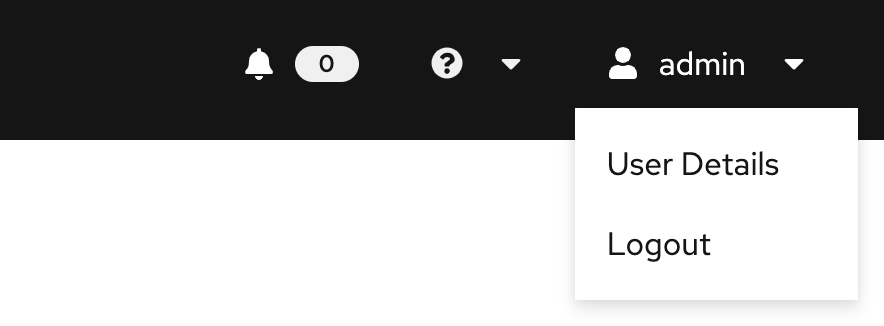
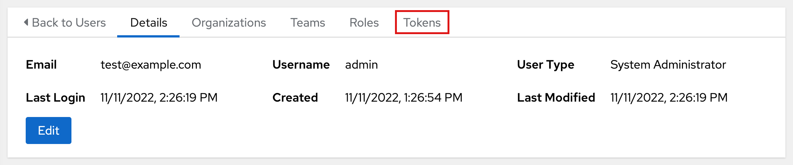
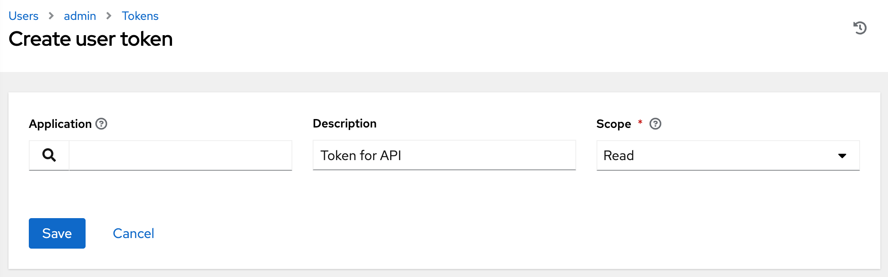
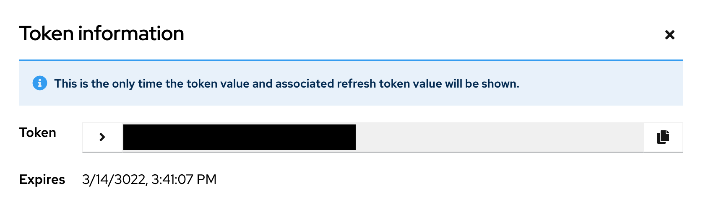

# aap-oauth-token

Instructions for retrieving an OAuth token to interact with Ansible Automation Platform APIs

[Official AAP OAuth Docs](https://docs.ansible.com/automation-controller/latest/html/controllerapi/authentication.html#api-oauth2-auth)

## Automation Script

Export a few configuration variables and run `source get_token.sh`

```bash
export AAP_HOST=controller.example.com
export AAP_USER=admin
export AAP_PWD=s3cr3t
```

The expected output contains your token and an example GET request for the related user
```bash
USER: admin
TOKEN: t0k3n
EXPIRATION: 3022-03-14T21:23:46.863461Z
SCOPE: write
GET /api/v2/users/1/:
{
    "id": 1,
    "type": "user",
    "url": "/api/v2/users/1/",
    ...
    "username": "admin",
}
```

The environment variable `$AAP_TOKEN` is set for future requests, e.g.
```bash
# Launch a job template

curl -k -X POST \
  -H "Authorization: Bearer $AAP_TOKEN" \
  -H "Content-Type: application/json" \
  --data '{"limit" : "ansible"}' \
  https://$AAP_HOST/api/v2/job_templates/1/launch/
```

## Manual Process

1. Navigate to Controller UI
1. On the right side of the navbar, select your username > User Details
    
1. Select the Tokens tab
    
1. Create a token
    
    - Leave the application name blank
    - Add a description
    - Choose the desired scope
1. Copy token to use in future API requests
    
